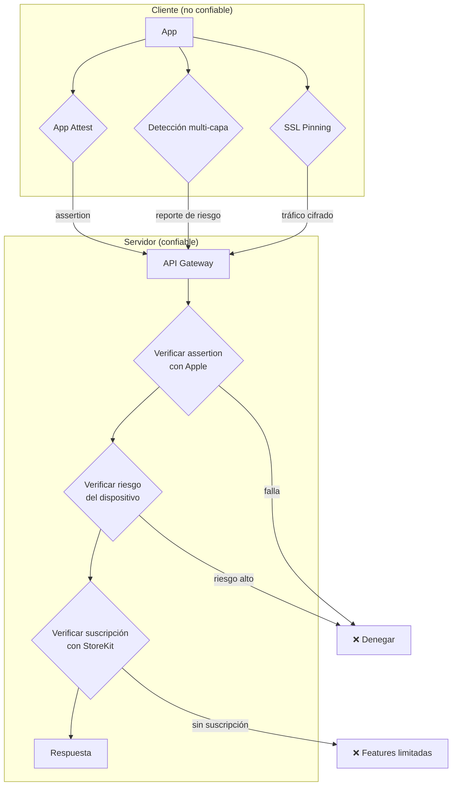

# Guía de Protección de Apps iOS — Contra TrollStore y Amenazas Similares

> **Propósito:** Implementación práctica de defensas contra TrollStore, sideloading, parcheo de binarios, jailbreak e instrumentación dinámica. Incluye código Swift listo para integrar y verificación del lado del servidor.

---

## 1. Panorama de amenazas similares

TrollStore no es la única amenaza. Estas son las herramientas y vulnerabilidades que un atacante puede usar contra tu app:

| Amenaza | Tipo | Qué permite | Versiones afectadas |
|---|---|---|---|
| **TrollStore** | Bug de firma (CoreTrust) | Instalar apps parcheadas con entitlements arbitrarios | iOS 14.0–16.6.1, 17.0 |
| **Sideloadly / AltStore / SideStore** | Sideload con Apple ID | Instalar IPAs parcheadas (re-firma cada 7 días) | Todas |
| **ESign / Scarlet / Signulous** | Certificados enterprise fraudulentos | Instalar apps parcheadas sin límite de expiración | Todas |
| **Jailbreaks (Dopamine, palera1n)** | Root completo | Todo lo anterior + hooking global + acceso a memoria | iOS 12–16.6.1 (según exploit) |
| **Frida / Objection** | Instrumentación dinámica | Hooking de cualquier función en runtime | Todas (con jailbreak o app inyectada) |
| **dumpdecrypter / frida-dump** | Dump de memoria | Extraer el IPA descifrado de un dispositivo | Requiere jailbreak o debugger |
| **Flex / FlexAll** | Parcheo en runtime | Modificar métodos sin recompilar | Requiere jailbreak |
| **SSL Kill Switch** | Bypass de pinning | Intercepta tráfico HTTPS de tu app | Requiere jailbreak |
| **MacDirtyCow (CVE-2022-46689)** | Race condition en kernel | Modificar archivos de solo lectura | iOS 15.0–16.8.1 |
| **CVE-2023-41994** | Bypass de verificación de firma | Instalación permanente sin firma válida | iOS 17.0 exacto |

**Conclusión clave:** No puedes prevenir que instalen tu app parcheada. Lo que puedes hacer es **detectarlo** y **negar servicio** desde el servidor.

---

## 2. Principio fundamental: nunca confiar en el cliente

```
┌────────────────────────────────────────────────────────────────┐
│  REGLA DE ORO: Cualquier verificación en el cliente puede      │
│  ser parcheada. La seguridad real vive en el servidor.         │
└────────────────────────────────────────────────────────────────┘
```

- ❌ Verificar licencia solo en el cliente → se parchea en 5 minutos
- ❌ Embeber API keys en el binario → se extraen con `strings`
- ❌ Ocultar features con un flag en el cliente → se activa con un patch
- ✅ El servidor decide qué puede hacer cada usuario
- ✅ El servidor verifica que la app es genuina (App Attest)
- ✅ El cliente solo es una "vista", no un guardián

---

## 3. Defensa 1: App Attest (la más fuerte)

Apple verifica criptográficamente que tu app es genuina y no ha sido modificada. **Un atacante no puede falsificar esto** porque requiere la clave privada de Apple.

### 3.1 Flujo de App Attest

```
┌──────────┐                          ┌──────────┐
│   App    │                          │ Servidor │
└────┬─────┘                          └────┬─────┘
     │  1. generateKey()                   │
     │  → keyId                            │
     │                                      │
     │  2. Pide challenge ─────────────────>│
     │  <───────────── challenge ───────────│
     │                                      │
     │  3. attestKey(keyId, hash(challenge))│
     │  → attestationObject                 │
     │                                      │
     │  4. Envía attestation ──────────────>│
     │                                      │  5. Servidor verifica con Apple
     │                                      │     POST /devicecheck/validateattestation
     │  <───────── resultado ───────────────│     (Apple confirma: app genuina)
     │                                      │
     │  5. Por cada petición crítica:       │
     │     generateAssertion(keyId, hash)   │
     │     → assertion                      │
     │     → servidor verifica con Apple    │
     └──────────────────────────────────────┘
```

### 3.2 Implementación en el cliente (Swift)

```swift
import DeviceCheck
import CryptoKit
import Foundation

class AppAttestManager {
    static let shared = AppAttestManager()
    
    private let service = DCAppAttestService.shared
    private var keyId: String?
    
    // MARK: - Setup inicial (una vez por instalación)
    
    func setupIfNeeded(completion: @escaping (Bool) -> Void) {
        // 1. Verificar que el dispositivo soporta App Attest
        guard service.isSupported else {
            print("[AppAttest] No soportado en este dispositivo")
            completion(false)
            return
        }
        
        // 2. Si ya tenemos keyId guardado, solo verificar
        if let existingKeyId = UserDefaults.standard.string(forKey: "app_attest_key_id") {
            self.keyId = existingKeyId
            completion(true)
            return
        }
        
        // 3. Generar nueva clave
        service.generateKey { [weak self] keyId, error in
            guard let keyId = keyId, error == nil else {
                print("[AppAttest] Error generando clave: \(error?.localizedDescription ?? "")")
                completion(false)
                return
            }
            
            self?.keyId = keyId
            UserDefaults.standard.set(keyId, forKey: "app_attest_key_id")
            self?.attestKey(keyId: keyId, completion: completion)
        }
    }
    
    // MARK: - Attestation (verificación única con Apple)
    
    private func attestKey(keyId: String, completion: @escaping (Bool) -> Void) {
        // 1. Pedir challenge único al servidor
        //    (el servidor genera un valor aleatorio y lo guarda temporalmente)
        APIClient.shared.getAttestationChallenge { challenge in
            guard let challenge = challenge else {
                completion(false)
                return
            }
            
            // 2. Hash del challenge
            let challengeData = Data(challenge.utf8)
            let clientDataHash = Data(SHA256.hash(data: challengeData))
            
            // 3. Generar attestation con Apple
            self.service.attestKey(keyId, clientDataHash: clientDataHash) { attestation, error in
                guard let attestation = attestation, error == nil else {
                    print("[AppAttest] Error en attestation: \(error?.localizedDescription ?? "")")
                    completion(false)
                    return
                }
                
                // 4. Enviar al servidor para que verifique con Apple
                APIClient.shared.verifyAttestation(
                    attestation: attestation.base64EncodedString(),
                    keyId: keyId
                ) { verified in
                    completion(verified)
                }
            }
        }
    }
    
    // MARK: - Assertion (por cada petición crítica)
    
    /// Genera una assertion para incluir en peticiones sensibles.
    /// El servidor la verifica con Apple antes de procesar la petición.
    func generateAssertion(for requestData: Data,
                           completion: @escaping (String?) -> Void) {
        guard let keyId = keyId else {
            completion(nil)
            return
        }
        
        let clientDataHash = Data(SHA256.hash(data: requestData))
        
        service.generateAssertion(keyId, clientDataHash: clientDataHash) { assertion, error in
            guard let assertion = assertion, error == nil else {
                completion(nil)
                return
            }
            completion(assertion.base64EncodedString())
        }
    }
}
```

### 3.3 Uso en peticiones críticas

```swift
class APIClient {
    static let shared = APIClient()
    
    /// Ejemplo: petición que verifica una suscripción
    func validateSubscription(userId: String, completion: @escaping (Bool) -> Void) {
        let endpoint = "https://api.tuapp.com/v1/subscription/validate"
        let body = "{\"user_id\": \"\(userId)\"}"
        let requestData = Data("\(endpoint)\(body)".utf8)
        
        // 1. Generar assertion para esta petición específica
        AppAttestManager.shared.generateAssertion(for: requestData) { assertion in
            guard let assertion = assertion else {
                // Sin assertion = no se puede verificar → denegar
                completion(false)
                return
            }
            
            // 2. Enviar petición con assertion
            var request = URLRequest(url: URL(string: endpoint)!)
            request.httpMethod = "POST"
            request.setValue("application/json", forHTTPHeaderField: "Content-Type")
            request.setValue(assertion, forHTTPHeaderField: "X-App-Assertion")
            request.httpBody = Data(body.utf8)
            
            URLSession.shared.dataTask(with: request) { data, response, error in
                guard let data = data,
                      let result = try? JSONDecoder().decode(SubscriptionResponse.self, from: data) else {
                    completion(false)
                    return
                }
                completion(result.isValid)
            }.resume()
        }
    }
}
```

### 3.4 Verificación en el servidor (Node.js)

```javascript
const jwt = require('jsonwebtoken');
const fs = require('fs');
const crypto = require('crypto');

// --- Autenticación con Apple (JWT con tu clave .p8 de DeviceCheck) ---

const TEAM_ID = process.env.APPLE_TEAM_ID;
const KEY_ID = process.env.APPLE_KEY_ID;
const PRIVATE_KEY = fs.readFileSync(process.env.APPLE_KEY_PATH);

function getAppleJWT() {
    return jwt.sign({}, PRIVATE_KEY, {
        algorithm: 'ES256',
        expiresIn: '1h',
        issuer: TEAM_ID,
        header: { alg: 'ES256', kid: KEY_ID }
    });
}

// --- Paso 1: Generar challenge (endpoint: GET /attestation/challenge) ---

app.get('/attestation/challenge', authenticateUser, (req, res) => {
    const challenge = crypto.randomBytes(32).toString('hex');
    
    // Guardar challenge temporalmente (Redis, 5 min TTL)
    redis.setex(`attest_challenge:${req.user.id}`, 300, challenge);
    
    res.json({ challenge });
});

// --- Paso 2: Verificar attestation (endpoint: POST /attestation/verify) ---

app.post('/attestation/verify', authenticateUser, async (req, res) => {
    const { attestation, keyId } = req.body;
    
    // Recuperar el challenge guardado
    const challenge = await redis.get(`attest_challenge:${req.user.id}`);
    if (!challenge) {
        return res.status(400).json({ error: 'Challenge expirado' });
    }
    
    // Verificar con Apple
    const response = await fetch('https://developer.apple.com/devicecheck/validateattestation', {
        method: 'POST',
        headers: {
            'Authorization': `Bearer ${getAppleJWT()}`,
            'Content-Type': 'application/json'
        },
        body: JSON.stringify({
            attestationObject: attestation,  // base64
            keyID: keyId,                     // string
            challenge: challenge              // hex string
        })
    });
    
    const result = await response.json();
    
    if (result.success) {
        // ✅ App genuina verificada por Apple
        // Guardar la clave pública del dispositivo para futuras assertions
        await db.saveDeviceKey(req.user.id, keyId, result.publicKey);
        await redis.del(`attest_challenge:${req.user.id}`);
        res.json({ verified: true });
    } else {
        // ❌ App modificada o dispositivo comprometido
        // Registrar el incidente y denegar
        await logSecurityIncident(req.user.id, 'attestation_failed', result);
        res.status(403).json({ verified: false, error: 'App no verificada' });
    }
});

// --- Paso 3: Verificar assertion en cada petición crítica ---

async function verifyAssertion(userId, assertion, keyId, requestData) {
    // El challenge aquí es el hash de los datos de la petición
    const challenge = crypto.createHash('sha256').update(requestData).digest('hex');
    
    const response = await fetch('https://developer.apple.com/devicecheck/validateassertion', {
        method: 'POST',
        headers: {
            'Authorization': `Bearer ${getAppleJWT()}`,
            'Content-Type': 'application/json'
        },
        body: JSON.stringify({
            assertion: assertion,  // base64
            keyID: keyId,          // string
            challenge: challenge   // hex string
        })
    });
    
    const result = await response.json();
    
    if (!result.success) return false;
    
    // Verificar que la clave pública coincide con la registrada
    const storedKey = await db.getDeviceKey(userId, keyId);
    return storedKey === result.publicKey;
}

// --- Middleware para proteger endpoints críticos ---

app.post('/v1/subscription/validate', authenticateUser, async (req, res) => {
    const assertion = req.headers['x-app-assertion'];
    const keyId = req.headers['x-app-key-id'];
    
    if (!assertion || !keyId) {
        return res.status(403).json({ error: 'Assertion requerida' });
    }
    
    const requestData = `${req.originalUrl}${JSON.stringify(req.body)}`;
    const isValid = await verifyAssertion(req.user.id, assertion, keyId, requestData);
    
    if (!isValid) {
        await logSecurityIncident(req.user.id, 'assertion_failed', {});
        return res.status(403).json({ error: 'App no verificada' });
    }
    
    // ✅ App genuina — procesar la petición
    // ... lógica de suscripción ...
});
```

### 3.5 Configuración en Apple Developer

1. Ve a [Apple Developer → Keys](https://developer.apple.com/account/resources/authkeys/list)
2. Crea una nueva clave con el servicio **DeviceCheck** habilitado
3. Descarga el archivo `.p8` y guarda el **Key ID**
4. Necesitas tu **Team ID** (Membership)

---

## 4. Defensa 2: Validación de licencias en el servidor

La lógica de suscripción/licencia **nunca** debe vivir en el cliente.

### 4.1 Arquitectura correcta

```
┌─────────────┐         ┌──────────────────────────────┐
│    App      │         │          Servidor            │
│             │         │                              │
│  Muestra UI │ ──────> │  1. Verifica App Attest      │
│  No decide  │  token  │  2. Verifica suscripción     │
│  nada       │         │  3. Verifica con Apple (StoreKit) │
│             │ <────── │  4. Devuelve qué features    │
│             │  JSON   │     están habilitadas        │
└─────────────┘         └──────────────────────────────┘
```

### 4.2 Implementación

```swift
// ❌ MAL — lógica en el cliente (se parchea)
func isProUser() -> Bool {
    return UserDefaults.standard.bool(forKey: "is_pro")  // parcheable
}

// ✅ BIEN — el servidor decide
class FeatureManager {
    private var enabledFeatures: Set<String> = []
    
    func refreshFeatures(userId: String, completion: @escaping () -> Void) {
        APIClient.shared.getEnabledFeatures(userId: userId) { [weak self] features in
            self?.enabledFeatures = features
            completion()
        }
    }
    
    func isEnabled(_ feature: String) -> Bool {
        return enabledFeatures.contains(feature)
    }
}

// En el servidor:
// GET /v1/features → { "features": ["premium_filter", "no_ads", "export"] }
// El servidor consulta StoreKit / la base de datos de suscripciones
```

### 4.3 Verificación de compras con StoreKit 2

```swift
import StoreKit

// Verificar que la compra es real consultando a Apple directamente
func verifyPurchases() async {
    do {
        let result = try await AppStore.sync()
        let entitlements = await Transaction.currentEntitlements
        
        for await entitlement in entitlements {
            // Enviar el transaction ID al servidor para verificación
            // El servidor verifica con App Store Server API
            let transaction = entitlement
            await APIClient.shared.verifyTransaction(
                transactionId: String(transaction.id),
                userId: currentUserId
            )
        }
    } catch {
        // Error de verificación — no habilitar features
    }
}
```

---

## 5. Defensa 3: SSL Pinning

Evita que un atacante intercepte el tráfico de tu app (análisis de API, MITM).

```swift
import Foundation

class PinnedURLSessionDelegate: NSObject, URLSessionDelegate {
    
    // Hash SHA-256 del certificado del servidor (SPKI pin)
    // Genera con: openssl s_client -connect api.tuapp.com:443 | openssl x509 -pubkey -noout | openssl pkey -pubin -outform der | openssl dgst -sha256 -binary | base64
    private let pinnedSPKIHashes: Set<String> = [
        "sha256/AAAAAAAAAAAAAAAAAAAAAAAAAAAAAAAAAAAAAAAAAAA=",
        "sha256/BBBBBBBBBBBBBBBBBBBBBBBBBBBBBBBBBBBBBBBBBBB="  // backup (rotación)
    ]
    
    func urlSession(_ session: URLSession,
                    didReceive challenge: URLAuthenticationChallenge,
                    completionHandler: @escaping (URLSession.AuthChallengeDisposition, URLCredential?) -> Void) {
        
        guard let serverTrust = challenge.protectionSpace.serverTrust else {
            completionHandler(.cancelAuthenticationChallenge, nil)
            return
        }
        
        // 1. Verificar cadena de certificados del sistema
        var error: CFError?
        guard SecTrustEvaluateWithError(serverTrust, &error) else {
            completionHandler(.cancelAuthenticationChallenge, nil)
            return
        }
        
        // 2. Extraer la clave pública del certificado del servidor
        guard let certificate = SecTrustGetCertificateAtIndex(serverTrust, 0),
              let publicKey = SecCertificateCopyKey(certificate),
              let publicKeyData = SecKeyCopyExternalRepresentation(publicKey, nil) as Data? else {
            completionHandler(.cancelAuthenticationChallenge, nil)
            return
        }
        
        // 3. Calcular hash SPKI y comparar con los pins
        let spkiHash = "sha256/" + Data(SHA256.hash(data: publicKeyData)).base64EncodedString()
        
        if pinnedSPKIHashes.contains(spkiHash) {
            completionHandler(.useCredential, URLCredential(trust: serverTrust))
        } else {
            // Certificado no coincide → posible MITM
            completionHandler(.cancelAuthenticationChallenge, nil)
        }
    }
}

// Uso:
let session = URLSession(configuration: .default,
                         delegate: PinnedURLSessionDelegate(),
                         delegateQueue: nil)
```

**Alternativa recomendada:** usa [TrustKit](https://github.com/datatheorem/TrustKit) (open source, mantiene pins actualizados, reporta fallos a tu servidor).

**Nota:** El pinning se puede bypass con Frida en dispositivos jailbroken, pero combinado con App Attest, el atacante necesita bypass de ambas capas.

---

## 6. Defensa 4: Detección multi-capa de jailbreak/tampering

**Importante:** Ninguna detección individual es suficiente. Usa **múltiples capas distribuidas** por el código, verificadas en momentos distintos, y reporta al servidor (no solo bloquea localmente — el bloqueo local se parchea).

```swift
import Foundation
import MachO
import UIKit
import Security

class TamperDetector {
    
    // MARK: - Capa 1: Archivos característicos de jailbreak
    
    static func hasJailbreakFiles() -> Bool {
        let suspiciousPaths = [
            "/Applications/Cydia.app",
            "/Applications/Sileo.app",
            "/Applications/Zebra.app",
            "/Applications/Installer.app",
            "/Library/MobileSubstrate/MobileSubstrate.dylib",
            "/Library/MobileSubstrate/DynamicLibraries",
            "/bin/bash",
            "/bin/sh",
            "/usr/sbin/sshd",
            "/usr/libexec/sftp-server",
            "/etc/apt",
            "/etc/ssh/sshd_config",
            "/private/var/lib/apt",
            "/private/var/lib/cydia",
            "/private/var/mobile/Library/SBSettings/Themes",
            "/private/var/stash"
        ]
        return suspiciousPaths.contains { FileManager.default.fileExists(atPath: $0) }
    }
    
    // MARK: - Capa 2: Symlinks sospechosos
    
    static func hasSuspiciousSymlinks() -> Bool {
        let suspiciousSymlinks = [
            "/var",
            "/private/var/log/syslog",
            "/private/var/tmp/cydia.log",
            "/private/var/lib/apt/"
        ]
        return suspiciousSymlinks.contains { path in
            do {
                let attrs = try FileManager.default.attributesOfItem(atPath: path)
                return attrs[.type] as? String == FileAttributeType.symbolicLink.rawValue
            } catch {
                return false
            }
        }
    }
    
    // MARK: - Capa 3: Escritura fuera del sandbox
    
    static func canWriteOutsideSandbox() -> Bool {
        let testPath = "/private/.tamper_test_\(UUID().uuidString)"
        do {
            try "test".write(toFile: testPath, atomically: true, encoding: .utf8)
            try? FileManager.default.removeItem(atPath: testPath)
            return true  // ✗ Jailbroken — el sandbox debería bloquear esto
        } catch {
            return false  // ✓ Normal — sandbox funcionando
        }
    }
    
    // MARK: - Capa 4: Variables de entorno de inyección
    
    static func hasInjectionEnvironment() -> Bool {
        let suspiciousVars = [
            "DYLD_INSERT_LIBRARIES",     // Inyección de dylibs
            "_MSSafeMode",               // MobileSubstrate safe mode
            "DYLD_PRINT_LIBRARIES",      // Debug de dyld
            "OBJC_DISABLE_INITIALIZE_FORK_SAFETY"
        ]
        return suspiciousVars.contains { getenv($0) != nil }
    }
    
    // MARK: - Capa 5: Imágenes dyld sospechosas cargadas
    
    static func hasSuspiciousLoadedImages() -> Bool {
        let suspiciousLibraries = [
            "substrate",           // Cydia Substrate
            "substitute",          // Substitute
            "libhooker",           // libhooker (Chimera/Odyssey)
            "frida",               // Frida
            "frida-agent",
            "cynject",             // Cycript
            "SSLKillSwitch",       // Bypass de pinning
            "SSLKillSwitch2",
            "MobileSubstrate",
            "TweakInject",
            "flexall",             // Flex patches
            "Shadow",              // Shadow (anti-detection bypass)
            "A-Bypass",            // A-Bypass
            "Liberty"
        ]
        
        let count = _dyld_image_count()
        for i in 0..<count {
            guard let name = _dyld_get_image_name(i) else { continue }
            let lowercased = name.lowercased()
            if suspiciousLibraries.contains(where: { lowercased.contains($0.lowercased()) }) {
                return true
            }
        }
        return false
    }
    
    // MARK: - Capa 6: URL schemes de apps de jailbreak
    
    static func canOpenJailbreakURLSchemes() -> Bool {
        // Requiere añadir en Info.plist:
        // <key>LSApplicationQueriesSchemes</key>
        // <array>
        //   <string>cydia</string>
        //   <string>sileo</string>
        //   <string>zbra</string>
        // </array>
        let schemes = ["cydia://package/com.example", "sileo://package/com.example"]
        return schemes.contains { scheme in
            guard let url = URL(string: scheme) else { return false }
            return UIApplication.shared.canOpenURL(url)
        }
    }
    
    // MARK: - Capa 7: Verificación de firma del binario
    
    static func hasValidCodeSignature() -> Bool {
        guard let task = SecTaskCreateFromSelf(nil) else {
            return false
        }
        
        // Verificar el team identifier — si la app fue re-firmada
        // con otro certificado, no coincidirá
        guard let teamId = SecTaskCopyValueForEntitlement(
            task,
            "com.apple.developer.team-identifier" as CFString,
            nil
        ) as? String else {
            return false
        }
        
        // ⚠️ Reemplaza con TU Team ID real
        let expectedTeamId = "TU_TEAM_ID_AQUI"
        return teamId == expectedTeamId
    }
    
    // MARK: - Capa 8: Verificación de entitlements
    
    static func hasExpectedEntitlements() -> Bool {
        guard let task = SecTaskCreateFromSelf(nil) else {
            return false
        }
        
        // Si un atacante instaló la app con entitlements de plataforma
        // (via TrollStore), estos entitlements estarán presentes:
        let platformEntitlements = [
            "com.apple.private.security.no-container",
            "com.apple.private.security.storage.AppDataContainers",
            "platform-application",
            "com.apple.system-task-ports"
        ]
        
        for entitlement in platformEntitlements {
            if SecTaskCopyValueForEntitlement(task, entitlement as CFString, nil) != nil {
                // Entitlement de plataforma presente = instalada via TrollStore
                return false
            }
        }
        
        return true
    }
    
    // MARK: - Capa 9: Detección de debugger
    
    static func isDebuggerAttached() -> Bool {
        var info = kinfo_proc()
        var mib: [Int32] = [CTL_KERN, KERN_PROC, KERN_PROC_PID, getpid()]
        var size = MemoryLayout<kinfo_proc>.stride
        
        let result = sysctl(&mib, 4, &info, &size, nil, 0)
        if result == 0 {
            return (info.kp_proc.p_flag & P_TRACED) != 0
        }
        return false
    }
    
    // MARK: - Capa 10: Anti-debugging (ptrace PT_DENY_ATTACH)
    
    static func denyDebuggerAttach() {
        // ptrace no está expuesto en Swift — usar dlsym
        let PT_DENY_ATTACH: Int32 = 31
        
        typealias PtraceFunc = @convention(c) (
            Int32, Int32, UnsafeMutablePointer<Int32>?, Int32
        ) -> Int32
        
        guard let ptracePtr = dlsym(dlopen(nil, RTLD_LAZY), "ptrace") else { return }
        let ptrace = unsafeBitCast(ptracePtr, to: PtraceFunc.self)
        _ = ptrace(PT_DENY_ATTACH, 0, nil, 0)
    }
    
    // MARK: - Evaluación combinada (reportar al servidor)
    
    struct TamperReport {
        let jailbreakFiles: Bool
        let suspiciousSymlinks: Bool
        let sandboxEscape: Bool
        let injectionEnv: Bool
        let suspiciousImages: Bool
        let jailbreakSchemes: Bool
        let validSignature: Bool
        let expectedEntitlements: Bool
        let debuggerAttached: Bool
        
        var riskScore: Int {
            var score = 0
            if jailbreakFiles { score += 20 }
            if suspiciousSymlinks { score += 10 }
            if sandboxEscape { score += 25 }
            if injectionEnv { score += 15 }
            if suspiciousImages { score += 20 }
            if jailbreakSchemes { score += 10 }
            if !validSignature { score += 30 }
            if !expectedEntitlements { score += 30 }
            if debuggerAttached { score += 10 }
            return min(score, 100)
        }
        
        var isCompromised: Bool {
            return riskScore >= 30
        }
    }
    
    static func performFullScan() -> TamperReport {
        return TamperReport(
            jailbreakFiles: hasJailbreakFiles(),
            suspiciousSymlinks: hasSuspiciousSymlinks(),
            sandboxEscape: canWriteOutsideSandbox(),
            injectionEnv: hasInjectionEnvironment(),
            suspiciousImages: hasSuspiciousLoadedImages(),
            jailbreakSchemes: canOpenJailbreakURLSchemes(),
            validSignature: hasValidCodeSignature(),
            expectedEntitlements: hasExpectedEntitlements(),
            debuggerAttached: isDebuggerAttached()
        )
    }
}
```

### 6.1 Estrategia de respuesta (crítica)

**No bloquees inmediatamente en el cliente** — el atacante parchea el bloqueo. En su lugar:

```swift
class SecurityManager {
    
    /// Verificación silenciosa — reporta al servidor
    func performSecurityCheck() {
        let report = TamperDetector.performFullScan()
        
        // 1. Reportar al servidor (silenciosamente)
        APIClient.shared.reportTamperStatus(
            riskScore: report.riskScore,
            details: [
                "jailbreak_files": report.jailbreakFiles,
                "sandbox_escape": report.sandboxEscape,
                "signature_valid": report.validSignature,
                "entitlements_valid": report.expectedEntitlements,
                "debugger": report.debuggerAttached
            ]
        )
        
        // 2. El SERVIDOR decide qué hacer:
        //    - Riesgo alto → denegar peticiones críticas
        //    - Riesgo medio → requerir App Attest adicional
        //    - Riesgo bajo → permitir
        
        // 3. Solo para casos extremos, degradar localmente
        //    (ej: deshabilitar features premium sin verificar con servidor)
        if report.riskScore >= 70 {
            // Degradación local — pero el servidor ya sabe
            FeatureManager.shared.disableAllFeatures()
        }
    }
}
```

**En el servidor:**

```javascript
// Middleware de riesgo
app.use('/v1/', async (req, res, next) => {
    const riskScore = await db.getUserRiskScore(req.user.id);
    
    if (riskScore >= 70) {
        return res.status(403).json({ error: 'Dispositivo no autorizado' });
    }
    
    if (riskScore >= 30) {
        // Requerir App Attest para peticiones críticas
        req.requireAttestation = true;
    }
    
    next();
});
```

---

## 7. Defensa 5: Endurecimiento del Keychain

```swift
import Security

class SecureStorage {
    
    /// Guardar con protección máxima — solo accesible cuando el
    /// dispositivo está desbloqueado, y solo desde este dispositivo
    static func store(_ data: Data, forKey key: String) -> Bool {
        let query: [String: Any] = [
            kSecClass as String: kSecClassGenericPassword,
            kSecAttrAccount as String: key,
            kSecAttrService as String: Bundle.main.bundleIdentifier ?? "com.tuapp",
            kSecValueData as String: data,
            
            // ✅ Protección clave: solo este dispositivo, solo desbloqueado
            kSecAttrAccessible as String: kSecAttrAccessibleWhenUnlockedThisDeviceOnly,
            
            // ✅ Restringir acceso a apps con el mismo team ID
            kSecAttrAccessGroup as String: "TU_TEAM_ID.com.tuapp.shared"
        ]
        
        // Eliminar si ya existe
        SecItemDelete(query as CFDictionary)
        
        let status = SecItemAdd(query as CFDictionary, nil)
        return status == errSecSuccess
    }
    
    static func retrieve(forKey key: String) -> Data? {
        let query: [String: Any] = [
            kSecClass as String: kSecClassGenericPassword,
            kSecAttrAccount as String: key,
            kSecAttrService as String: Bundle.main.bundleIdentifier ?? "com.tuapp",
            kSecAttrAccessGroup as String: "TU_TEAM_ID.com.tuapp.shared",
            kSecReturnData as String: true,
            kSecMatchLimit as String: kSecMatchLimitOne
        ]
        
        var result: AnyObject?
        let status = SecItemCopyMatching(query as CFDictionary, &result)
        
        guard status == errSecSuccess else { return nil }
        return result as? Data
    }
}
```

**Por qué importa:** Una app instalada via TrollStore con entitlement `com.apple.private.security.storage.AppDataContainers` puede intentar leer datos de otras apps. La protección `ThisDeviceOnly` + access group restringido limita el daño.

---

## 8. Defensa 6: Ofuscación y endurecimiento del binario

### 8.1 Técnicas gratuitas

```swift
// 1. NO uses nombres descriptivos para funciones de seguridad
// ❌ func isJailbroken() -> Bool          // fácil de encontrar y parchear
// ✅ func _v() -> Bool                     // difícil de localizar

// 2. Distribuye las verificaciones — no en un solo lugar
// ❌ Un solo checkSecurity() al inicio
// ✅ Verificaciones dispersas en diferentes flujos de la app

// 3. Verifica en momentos inesperados
//    (no solo al inicio — el atacante puede parchear solo el inicio)

// 4. Usa verificaciones indirectas
func _c7() -> Bool {
    // En lugar de retornar directamente, calcula algo que
    // depende del resultado de la verificación
    let a = TamperDetector.hasJailbreakFiles() ? 3 : 7
    let b = TamperDetector.canWriteOutsideSandbox() ? 2 : 5
    return (a * b) % 2 == 1  // true solo si ambas pasan
}

// 5. Strings ofuscados (evita que `strings` revele endpoints)
func _s(_ i: [UInt8]) -> String {
    return String(bytes: i.map { $0 ^ 0x2A }, encoding: .utf8) ?? ""
}
// let endpoint = _s([0x59, 0x4D, 0x4C, ...])  // "api.tuapp.com" XOR 0x2A
```

### 8.2 Herramientas comerciales

| Herramienta | Qué hace | Precio |
|---|---|---|
| **iXGuard** (Guardsquare) | Ofuscación, anti-tampering, anti-debugging, cifrado de strings | Comercial |
| **Arxan** (Micro Focus) | Protección contra ingeniería inversa y tampering | Comercial |
| **DexProtector** | Ofuscación multi-capa | Comercial |
| **SwiftShield** | Ofuscación de nombres de clases (open source) | Gratis |

### 8.3 Configuración de Xcode

```
// En Build Settings:
// - Strip Debug Symbols During Copy: YES
// - Deployment Postprocessing: YES (Release)
// - Dead Code Stripping: YES
// - Enable Testability: NO (Release)

// En el scheme de Release:
// - Deshabilitar console output
// - Swift Optimization: -O (o -Osize)
```

---

## 9. Arquitectura de defensa recomendada



---

## 10. Matriz de defensa vs. ataque

| Ataque | App Attest | Validación servidor | SSL Pinning | Detección multi-capa | Ofuscación |
|---|---|---|---|---|---|
| App parcheada (TrollStore) | ✅ Bloquea | ✅ Bloquea | — | ⚠️ Detecta | ⚠️ Dificulta |
| Bypass de licencias | ✅ Bloquea | ✅ Bloquea | — | — | ⚠️ Dificulta |
| Análisis de API (MITM) | — | — | ✅ Bloquea | — | — |
| Frida/hooking | ✅ Bloquea* | ✅ Bloquea | ⚠️ Bypass posible | ✅ Detecta | ⚠️ Dificulta |
| Extracción de secretos | — | ✅ (no hay secretos) | — | — | ⚠️ Dificulta |
| Dump del binario | — | — | — | — | ⚠️ Dificulta |

*App Attest no se puede falsificar incluso con Frida, porque requiere la clave de Apple.

---

## 11. Checklist de implementación (priorizado)

### Fase 1 — Crítico (implementar primero)

- [ ] **Mover toda la lógica de licencia/suscripción al servidor**
- [ ] **Eliminar todos los secretos del binario** (API keys, endpoints internos)
- [ ] **Implementar App Attest** (cliente + servidor)
- [ ] **Verificar compras con StoreKit 2 + App Store Server API**

### Fase 2 — Importante

- [ ] **Implementar SSL Pinning** (o integrar TrustKit)
- [ ] **Implementar detección multi-capa de tampering** (las 10 capas)
- [ ] **Reportar riesgo al servidor** (no solo bloquear localmente)
- [ ] **Endurecer Keychain** (`ThisDeviceOnly` + access groups)

### Fase 3 — Deseable

- [ ] **Ofuscar el binario** (nombres, strings, control flow)
- [ ] **Distribuir verificaciones** por toda la app
- [ ] **Evaluar herramientas comerciales** (iXGuard, Arxan)
- [ ] **Configurar monitoreo de incidentes de seguridad** en el servidor

---

## 12. Limitaciones honestas

| Defensa | Qué NO puede hacer |
|---|---|
| App Attest | No previene la instalación — solo la detección al usar tu API |
| Detección de jailbreak | Se puede bypass con herramientas anti-detección (Shadow, A-Bypass) |
| SSL Pinning | Se puede bypass con Frida en dispositivos jailbroken |
| Ofuscación | Solo retrasa — un atacante determinado siempre puede revertirla |
| Validación en servidor | No protege datos que ya están en el cliente |

**La realidad:** No existe protección 100% efectiva del lado del cliente. La estrategia correcta es:

1. **Minimizar el valor del ataque** — nada crítico en el cliente
2. **Detectar y denegar** — App Attest + validación en servidor
3. **Elevar el costo** — múltiples capas, ofuscación, verificaciones dispersas
4. **Monitorear** — registrar incidentes y adaptar defensas

---

## 13. Referencias

- **App Attest (Apple):** https://developer.apple.com/documentation/devicecheck/appattestservice
- **App Attest server validation:** https://developer.apple.com/documentation/devicecheck/validating-apps-that-connect-to-your-server
- **StoreKit 2:** https://developer.apple.com/documentation/storekit
- **App Store Server API:** https://developer.apple.com/documentation/appstoreserverapi
- **TrustKit (SSL Pinning):** https://github.com/datatheorem/TrustKit
- **iXGuard:** https://www.guardsquare.com/ixguard
- **OWASP MASVS:** https://mas.owasp.org/masvs/
- **OWASP Mobile Top 10:** https://owasp.org/www-project-mobile-top-10/
- **Frida (para entender el ataque):** https://frida.re/
- **Objection (para entender el ataque):** https://github.com/sensepost/objection