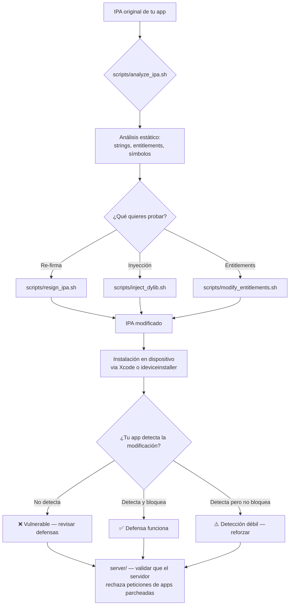

# CuySideStore — Mini SideStore para Pruebas de Seguridad

> **Propósito:** Herramienta de pruebas de seguridad interna para validar las defensas de tus apps iOS contra sideloading, re-firma, inyección de dylibs y detección de tampering. Simula los mecanismos de Sideloadly/AltStore/SideStore en un entorno controlado.

> ⚠️ **SOLO PARA USO INTERNO** — Pruebas de seguridad en tus propias apps y dispositivos registrados. No distribuir.

---

## Arquitectura del proyecto

```
CuySideStore/
├── README.md                          ← Este archivo
├── docs/
│   ├── TESTING-PLAN.md                ← Plan de pruebas paso a paso
│   ├── DETECTION-VALIDATION.md        ← Cómo validar tus detecciones
│   └── RESULTS-TEMPLATE.md            ← Plantilla para registrar resultados
├── scripts/                           ← Herramientas de escritorio (macOS)
│   ├── resign_ipa.sh                  ← Re-firma un IPA con certificado propio
│   ├── inject_dylib.sh                ← Inyecta una dylib de prueba en un IPA
│   ├── modify_entitlements.sh         ← Modifica entitlements de un IPA
│   ├── analyze_ipa.sh                 ← Análisis estático de un IPA
│   └── setup_test_cert.sh             ← Crea certificado de pruebas autofirmado
├── test-dylibs/                       ← Dylibs de prueba (para inyección)
│   ├── hook_license.c                 ← Hook de bypass de licencia (simulado)
│   ├── hook_network.c                 ← Hook de intercepción de red (simulado)
│   └── Makefile                       ← Compila las dylibs de prueba
├── test-app/                          ← App de prueba vulnerable (para validar)
│   └── CuyTestApp/                    ← Código fuente de la app de prueba
│       ├── CuyTestApp.swift           ← App de prueba con detecciones básicas
│       ├── TamperDetector.swift       ← Detecciones a validar
│       └── Info.plist                 ← Configuración de la app de prueba
└── server/                            ← Servidor de pruebas (validación server-side)
    ├── package.json                   ← Dependencias (Node.js)
    ├── server.js                      ← API de pruebas con App Attest mock
    └── attestation-mock.js            ← Mock de App Attest para pruebas
```

---

## Requisitos

| Requisito | Detalle |
|---|---|
| macOS | 13+ (para scripts y Xcode) |
| Xcode | 15+ (para compilar la app de prueba) |
| Dispositivo iOS físico | Registrado en tu cuenta de desarrollador |
| Cuenta Apple Developer | Para firmar la app de prueba (gratis sirve) |
| Node.js | 18+ (para el servidor de pruebas) |
| Herramientas | `codesign`, `ldid` (brew install ldid), `libimobiledevice` |

```bash
# Instalar dependencias en macOS
brew install ldid libimobiledevice ideviceinstaller
```

---

## Flujo de pruebas completo



---

## Inicio rápido

### Paso 1: Configurar certificado de pruebas

```bash
cd CuySideStore/scripts
./setup_test_cert.sh
```

### Paso 2: Analizar tu IPA

```bash
./analyze_ipa.sh /path/a/TuApp.ipa
```

### Paso 3: Re-firmar y probar detecciones

```bash
# Re-firma con certificado de pruebas (simula sideloading)
./resign_ipa.sh /path/a/TuApp.ipa --cert "CuyTestCert" --output TuApp_resigned.ipa

# Inyecta una dylib de prueba (simula hooking)
./inject_dylib.sh /path/a/TuApp.ipa --dylib test-dylibs/hook_license.dylib --output TuApp_hooked.ipa
```

### Paso 4: Instalar y validar

```bash
# Instala en dispositivo via libimobiledevice
ideviceinstaller -i TuApp_resigned.ipa
```

Luego abre tu app y verifica si las detecciones funcionan. Registra los resultados en `docs/RESULTS-TEMPLATE.md`.

---

## ¿Por qué construir tu propio SideStore de pruebas?

1. **Control total** — sabes exactamente qué modificaciones se hicieron
2. **Reproducibilidad** — puedes repetir cada prueba con precisión
3. **Validación de defensas** — verificas que tus detecciones realmente funcionan
4. **Sin dependencias externas** — no dependes de Sideloadly/AltStore/SideStore
5. **Aprendizaje profundo** — entiendes el vector de ataque al implementarlo

## Diferencias con las herramientas reales

| Aspecto | SideStore real | CuySideStore |
|---|---|---|
| Firma | Apple ID del usuario | Certificado de pruebas propio |
| Instalación | Framework privado de iOS | Xcode / ideviceinstaller |
| Anisette server | Servidor Rust que emula Apple | No necesario (usamos Xcode) |
| JIT enabler | WireGuard VPN trick | No incluido |
| Cualquier IPA | Sí | Solo IPAs que tú prepares |
| Propósito | Distribución de apps | **Pruebas de seguridad** |

## Estado legal y ético

- ✅ Pruebas en **tus propias apps** y dispositivos registrados
- ✅ Validar defensas de seguridad de tu producto
- ❌ No distribuir apps de terceros
- ❌ No usar para piratear apps ajenas
- ❌ No usar en dispositivos de otros sin autorización